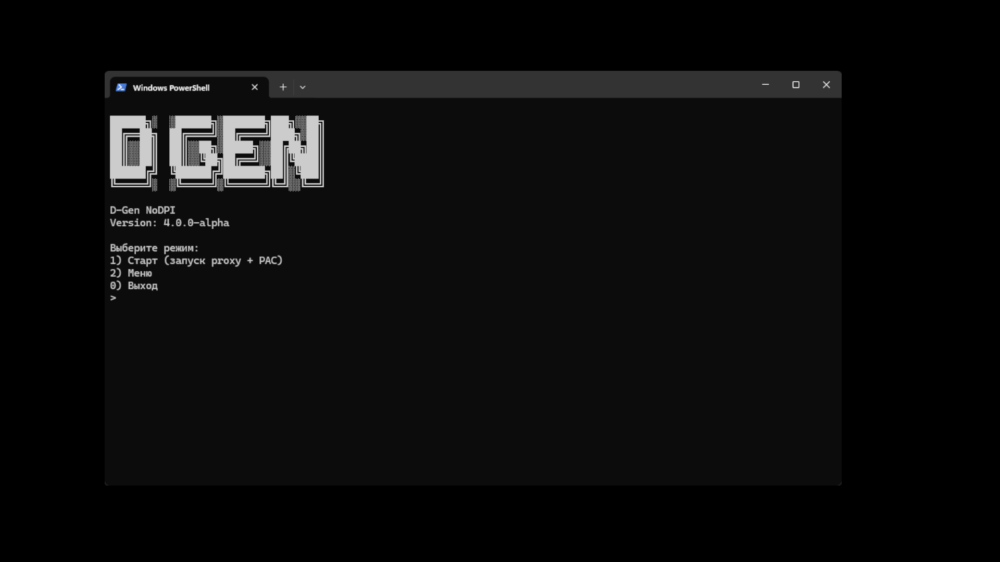
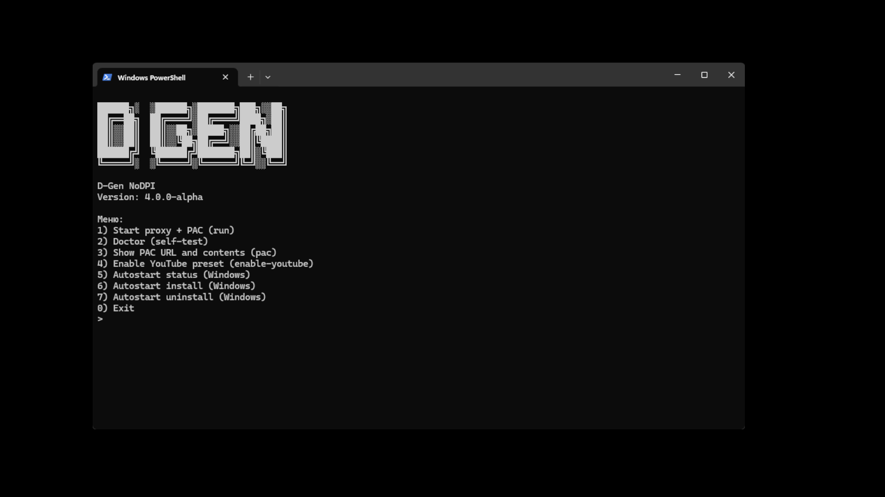

# D-gen | NoDPI (D‑Gen v4, local‑first)

**Язык:** Русский | **English:** `README.en.md`

**Сообщество (Telegram):** https://t.me/DisappearGen

Лицензия: **Apache-2.0** (см. `LICENSE`).

D‑Gen v4 — это **локальный HTTP/HTTPS‑прокси** (поддерживает CONNECT). Он умеет **фрагментировать первый TLS ClientHello** по правилам (через SNI) и предоставляет встроенный **PAC‑сервер** для быстрой настройки браузера.

> Важно: это **не VPN**. Прочитайте `DISCLAIMER.md` (ограничения и заметки по безопасности).

---

## Преимущества / чем отличается

- **Windows-first UX**: один рекомендуемый запуск (`run-dgen4.bat`) + интерактивное меню (не нужно запоминать команды).
- **Воспроизводимая настройка браузера**: встроенный PAC и запуск Chrome с `--proxy-pac-url=...` (меньше сюрпризов из-за системного прокси/политик/расширений).
- **HTTPS CONNECT + обычный HTTP** в одном инструменте, без MITM (не нужно ставить сертификаты).
- **Точечное поведение по доменам (SNI, best-effort)** + несколько стратегий фрагментации TLS ClientHello, включая per-rule override.
- **Поддерживаемость**: `doctor`, лог-файл, режим `stats/quiet`, аккуратный shutdown.
- **Практичные опции**: upstream CONNECT relay (план Б) и Windows автозапуск.

## Что делает приложение

- Поднимает локальный HTTP/HTTPS‑прокси (с CONNECT) и PAC‑сервер.
- Позволяет направить браузер через PAC (`http://127.0.0.1:8882/proxy.pac`) или через прямую настройку прокси (`127.0.0.1:8881`).
- Для HTTPS‑туннелей (CONNECT:443) может прочитать первый TLS record (ClientHello) и применить фрагментацию по правилам (best‑effort парсинг SNI).
- Трафик **не расшифровывает** (нет MITM), просто прокидывает байты между клиентом и апстримом.
- Даёт пресеты (`enable-youtube`), диагностику (`doctor`) 

## Быстрый старт (Windows) — рекомендовано

Требования:
- Python **3.8+**
- На Windows обычно доступен лаунчер **`py`**.

### 1) Запуск «одной кнопкой»

```bat
cd dgen-nodpi4-main
run-dgen4.bat
```

`run-dgen4.bat` делает ровно следующее:
1) запускает `enable-youtube` (записывает правила для YouTube / override фрагментации TLS в конфиг)
2) запускает прокси + PAC **в отдельном окне**: `py dgen_nodpi.py run`
3) запускает Chrome через PAC:
   - `--proxy-pac-url="http://127.0.0.1:8882/proxy.pac"`
   - `--disable-extensions --disable-quic --new-window`

Также он предупреждает, что Chrome должен быть **полностью закрыт** (иначе флаги прокси/PAC могут быть проигнорированы) и предлагает завершить `chrome.exe`.

Примечание про системный прокси:
- Если вы используете **`run-dgen4.bat`**, то системный прокси Windows обычно **настраивать не нужно**: Chrome запускается с `--proxy-pac-url=http://127.0.0.1:8882/proxy.pac`.
- Если вы запускаете прокси отдельно (`run.bat` / `py dgen_nodpi.py run`) и хотите, чтобы D-Gen использовали другие приложения/браузеры, настройте прокси вручную:
  - через PAC: `http://127.0.0.1:8882/proxy.pac`
  - или руками HTTP+HTTPS proxy: `127.0.0.1:8881`

### 2) Проверка

Откройте YouTube. В консоли D‑Gen вы должны увидеть строку со счётчиками (если `console.mode=stats`).

Остановка: **Ctrl+C** в окне прокси.

---

## Альтернативный запуск

### Запуск прокси без автозапуска Chrome

```bat
cd dgen-nodpi4-main
run.bat
```

> Важно: `run.bat` нужно запускать как **bat-файл** (через CMD или PowerShell),
> а не через Python. То есть **не** `py run.bat`.

`run.bat` запускает `py dgen_nodpi.py` **без команды**, и скрипт показывает интерактивный выбор:

- `1` — старт (запуск proxy + PAC)
- `2` — меню
- `0` — выход

Скриншот (стартовый экран):



---

## CLI: команды и режимы

### Команды

```bat
py dgen_nodpi.py --config dgen-nodpi4.json run
py dgen_nodpi.py doctor
py dgen_nodpi.py pac
py dgen_nodpi.py enable-youtube
py dgen_nodpi.py version

py dgen_nodpi.py status
py dgen_nodpi.py install
py dgen_nodpi.py uninstall
```

Примечания:
- `--config` (по умолчанию: `dgen-nodpi4.json`) — путь к JSON‑конфигу.
  - если путь **относительный**, он резолвится относительно директории скрипта.
- `run` запускает **proxy + PAC server**.
- `doctor` выполняет self‑test (версия Python, проверка бинда портов) и печатает “Next steps”.
- `pac` печатает PAC URL и содержимое `proxy.pac`.
- `enable-youtube` записывает рекомендованные правила YouTube в конфиг.
- `status/install/uninstall` управляют Windows автозапуском (см. ниже).

### Интерактивное меню

Пункты меню:

- `1` — Start proxy + PAC (run)
- `2` — Doctor (self-test)
- `3` — Show PAC URL and contents (pac)
- `4` — Enable YouTube preset (enable-youtube)
- `5` — Autostart status (Windows)
- `6` — Autostart install (Windows)
- `7` — Autostart uninstall (Windows)
- `8` — Disclaimer / limitations (read DISCLAIMER.md)
- `0` — Exit

Скриншот (меню):



Поведение UI:
- перед показом меню экран очищается
- после некоторых действий будет пауза и просьба нажать Enter

---

## Статистика в консоли (console.mode)

Когда `verbose=false` и `console.mode=stats`, D‑Gen печатает одну обновляющуюся строку:

- `Conn: active=… total=…` — активных/всего соединений клиентов
- `HTTP=…` — сколько HTTP‑запросов проксировано
- `CONNECT=…` — сколько CONNECT‑туннелей обработано
- `TLS_hello=…` — сколько TLS ClientHello увидели
- `frag=… (..%)` — сколько фрагментировали (и доля)

Чтобы отключить строку статистики:
- поставьте в конфиге `"console": { "mode": "quiet" }`

---

## Конфиг: `dgen-nodpi4.json`

Дефолтный конфиг лежит рядом со скриптом и называется `dgen-nodpi4.json`.

Ключевые секции:

- `proxy.host`, `proxy.port` — адрес/порт бинда прокси (по умолчанию `127.0.0.1:8881`)
- `pac.port` — порт PAC‑сервера (по умолчанию `8882`)
- `log.path` — путь к файлу лога
- `verbose` — если `true`, консольный лог более подробный (строка stats не показывается)
- `console.mode` — `stats` или `quiet`
- `domains.matching` — `strict` или `loose`
- `net.prefer_ipv4` — предпочитать IPv4 при соединениях (может помочь на проблемных IPv6 сетях)
- `net.dial_timeout_s` — таймаут на соединение
- `upstream.*` — режим upstream CONNECT relay
- `fragment.*` — глобальные дефолты фрагментации TLS ClientHello
- `rules[]` — правила по доменам

### Rules (`rules[]`)

Каждое правило:
- `suffix` — доменный суффикс (например, `.youtube.com` или `youtu.be`)
- `action` — `pass` или `fragment`
- опционально: `tls.fragment` — per‑rule override настроек фрагментации

### Сопоставление доменов: `domains.matching`

- `strict` (по умолчанию): точное совпадение или совпадение суффикса по границе через точку
  - совпадает с `example.com` и `www.example.com`
  - **не** совпадает с `notexample.com`
- `loose`: простой `endswith` (может совпадать с нежелательными хостами)

### Фрагментация TLS ClientHello

Поддерживаемые стратегии (`fragment.strategy`):
- `random_parts`
- `fixed_parts`
- `chunk_size`
- `tiny_first`
- `sni_cut` (best-effort разрез внутри/рядом с байтами SNI, затем дробление хвоста)

Опциональный jitter между отправками TLS records:
- `jitter_ms_min` / `jitter_ms_max`

> Важно: фрагментация применяется только для CONNECT:443 и только к первому TLS record.

---

## Remote-node baseline (upstream CONNECT relay)

Включайте `upstream`, если у вас есть вторая машина вне DPI‑зоны.

1) На **remote** машине: запустите D‑Gen обычно (HTTP proxy на `:8881`).
2) На **local** машине: укажите в `dgen-nodpi4.json`:

```json
"upstream": {
  "enabled": true,
  "host": "REMOTE_IP_OR_DNS",
  "port": 8881
}
```

Примечание по реализации:
- upstream используется **только для CONNECT** (HTTPS‑туннели). Обычный HTTP ходит напрямую.

---

## Windows автозапуск (install/status/uninstall)

```bat
py dgen_nodpi.py status
py dgen_nodpi.py install
py dgen_nodpi.py uninstall
```

Что делает `install`:
- добавляет запись в **HKCU Run** (текущий пользователь)
- запускает **только proxy + PAC** при входе в систему
- использует текущий Python (`sys.executable`) и сохраняет путь `--config`
- **не** запускает Chrome

---

## Диагностика

1) Self-test:

```bat
cd dgen-nodpi4-main
py dgen_nodpi.py doctor
```

2) Порты заняты (`8881`/`8882`): поменяйте `proxy.port` / `pac.port` в конфиге.

3) Chrome игнорирует системный прокси / мешают расширения:
- используйте `run-dgen4.bat` (PAC + extensions disabled + QUIC disabled)

4) QUIC/HTTP3:
- рекомендуется отключить QUIC/HTTP3 в Chrome/Edge (`chrome://flags` → QUIC → Disabled)

5) Логи:
- смотрите `log.path` (по умолчанию `dgen-nodpi4.log`)

---

## См. также

- `DISCLAIMER.md`
- `LICENSE`
