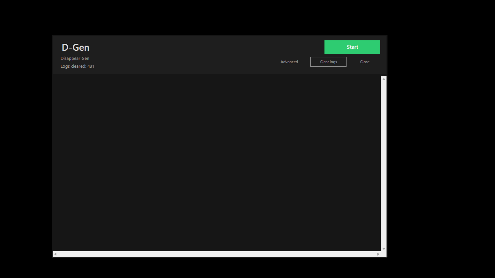
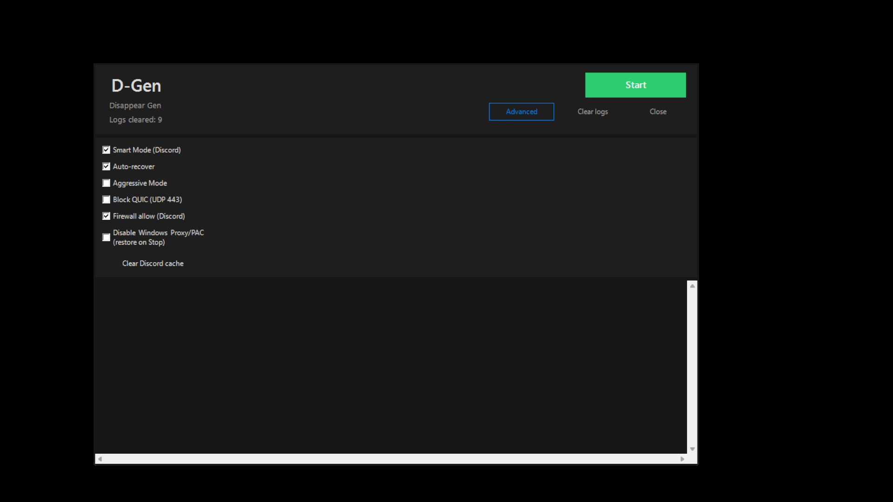
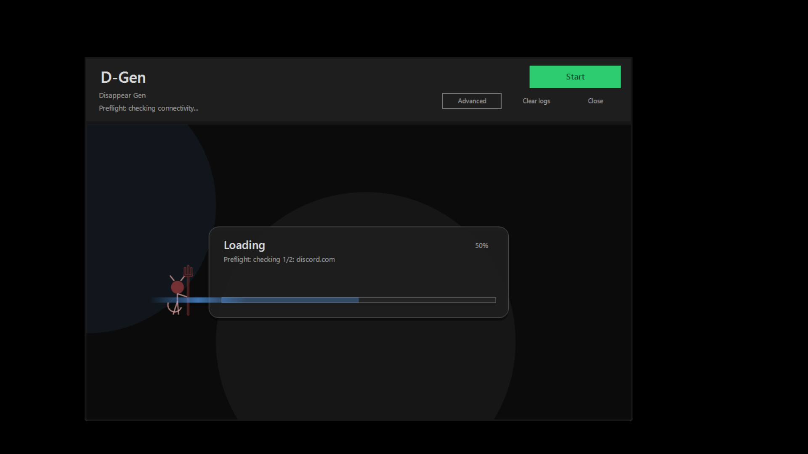

# D-Gen NODPI — автоматически настраивает подключение к большинству недоступных сервисов (Discord • YouTube • Roblox • Twitter • Twich ) 

> [!WARNING]
> **Официальный репозиторий:** https://github.com/ViZuaaaaa/NoDPI-D-Gen  
> Любые другие проекты/репаки/перезаливы — **фейк/неофициальные копии** (могут содержать вредоносные изменения). Используйте только официальный репозиторий.  
> Вопросы тут: https://t.me/DisappearGen

  

  
  
  

> [!IMPORTANT]
> Это Windows‑утилита. Для запуска и работы требуется **подтверждение UAC / права администратора**.

## Что это

**D‑Gen** — компактный GUI‑лаунчер, который:
- запускает набор готовых стратегий из папки `strategies/`;
- делает быстрые проверки доступности целей;
- автоматически подбирает наиболее рабочую стратегию для вашей сети;

Проект предназначен для ситуаций, когда доступ к сервисам ломается из‑за сетевых ограничений (DPI/фильтрация/прокси‑политики и т.п.).

## Скриншоты

| Start | Menu (Advanced) | Loading |
|---|---|---|
|  |  |  |

## Как запустить

1) Скачай и распакуй **всю папку проекта** так, чтобы рядом лежали:
- `D-Gen/`
- `strategies/`
- `lists/`
- `utils/`

2) Запусти **`oneclick-local.bat`**.

3) Если Windows попросит права администратора — **подтверди UAC**.

4) В окне **D‑Gen Launcher** нажми **Start**.

Остановка: кнопка **Stop**.

> [!NOTE]
> На «чистом ПК» обычно всё заводится на Windows 10/11 x64 при наличии прав администратора. 
> На корпоративных/жёстко настроенных ПК запуск может быть ограничен политиками PowerShell или антивирусом.

## Как работает (в общих чертах)

1) **Preflight**: короткие проверки (DNS/TCP/HTTP) и определение профиля блокировки.
2) **Запуск стратегии**: стартует `general*.bat` (внутри запускается `DGen.exe`).
3) **Scoring**: делаются быстрые проверки для ключевых целей (например Discord/Roblox), выбирается лучшая стратегия по score.
4) **Auto‑recover / Auto‑tune**: если ничего не проходит проверки — лаунчер может один раз усилить режим (Aggressive/QUIC block/широкие порты) и повторить попытку.
5) Дальше `DGen.exe` продолжает работать в фоне до Stop.

## Установка

### Вариант A — просто скачать и запустить
- Скачать ZIP (или релиз), распаковать.
- Запуск: `oneclick-local.bat`.

### Вариант B — из исходников
- Клонировать репозиторий.
- Запуск: `oneclick-local.bat`.

## Использование

### Основной сценарий
1) Нажми **Start**.
2) Открой Discord Desktop / Roblox / YouTube для проверки.
3) Если что‑то не работает — открой **Advanced**, попробуй включить Aggressive Mode или QUIC block и запусти заново.

### Advanced (что означает)
- **Smart Mode (Discord)** — включает «умный» подбор/проверки, заточенные под Discord.
- **Auto‑recover** — если стратегия не прошла проверки, попробует другую.
- **Aggressive Mode** — более «жёсткие» параметры стратегий.
- **Block QUIC (UDP 443)** — блокирует QUIC как один из частых источников проблем.
- **Firewall allow (Discord)** — помогает быстро разрешить Discord через firewall.
- **Disable Windows Proxy/PAC** — временно отключает системный proxy/PAC на время сессии (и восстанавливает на Stop).
- **Clear Discord cache** — очистка кеша Discord (иногда помогает при странных ошибках после изменения сети).

## Логи и диагностика

- Основной лог лаунчера: `D-Gen/logs/dgen-launch.log`
- Логи генератора: `D-Gen/logs/dgen-generator.*.log`
- Логи стратегии: `D-Gen/logs/dgen-strategy.*.log`
- Если GUI не открылся / сразу закрылся: `D-Gen/logs/launcher-startup.error.log`

## Troubleshooting

<b>Окно не запускается / сразу закрывается</b>

1) Запусти `oneclick-local.bat` ещё раз и **подтверди UAC**.
2) Открой `D-Gen/logs/launcher-startup.error.log` и смотри самый свежий кусок.
3) Проверь, что рядом есть `strategies/`, `lists/`, `utils/`.
4) Если Defender/антивирус блокирует файлы — добавь папку в исключения (если доверяешь исходникам).

<b>Start прошёл, но сервисы не работают</b>

1) Открой `D-Gen/logs/dgen-launch.log`.
2) Посмотри:
   - какой **block type** определён;
   - какая стратегия выбрана и какой **score**;
   - нет ли ошибок DGen/service.
3) Попробуй включить **Aggressive Mode** и/или **Block QUIC**, затем Start ещё раз.

## Структура проекта

- `oneclick-local.bat` — запуск GUI
- `D-Gen/launcher.ps1` — GUI + логика подбора стратегии
- `D-Gen/config.json` — конфиг
- `strategies/` — актуальные стратегии (`general*.bat`)
- `lists/` — домены/ipset
- `utils/` — утилиты

## Лицензия

Ограниченная лицензия  — см. `LICENSE`.
